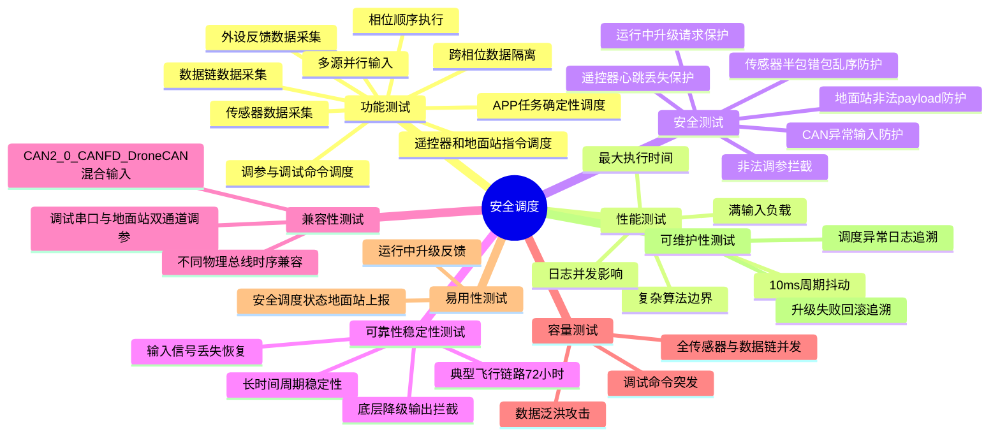
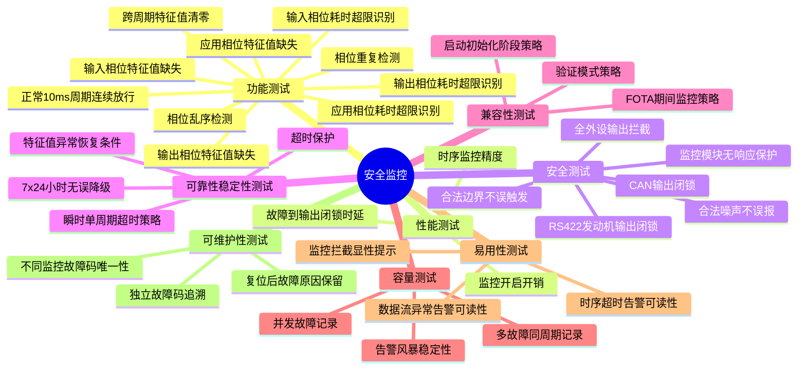
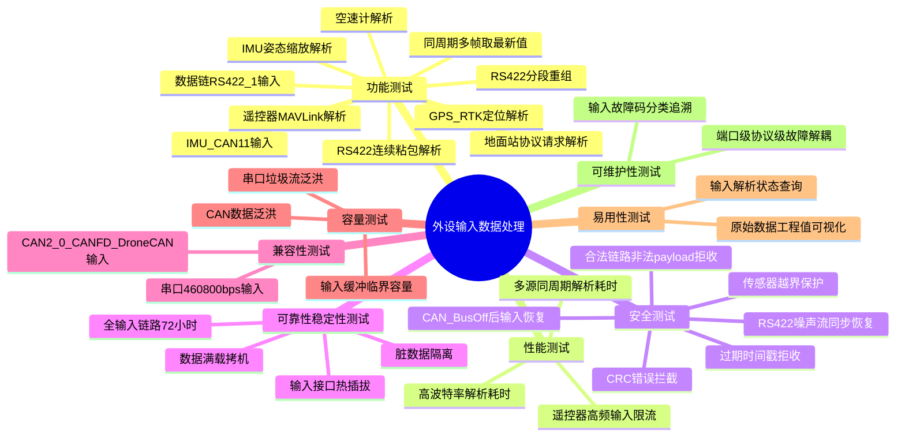
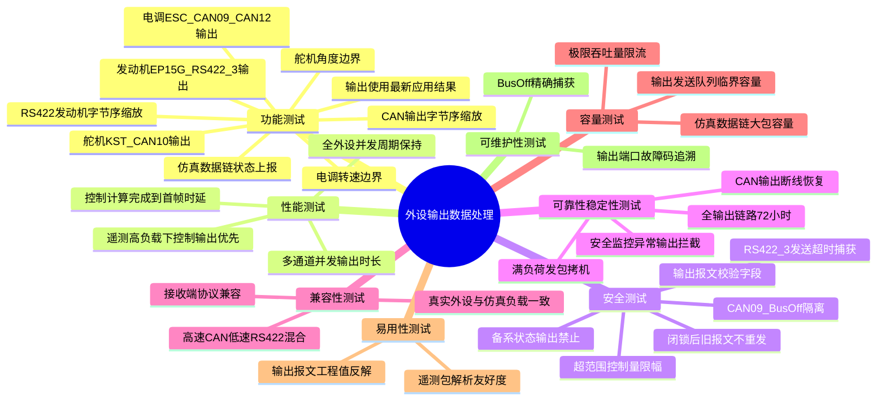
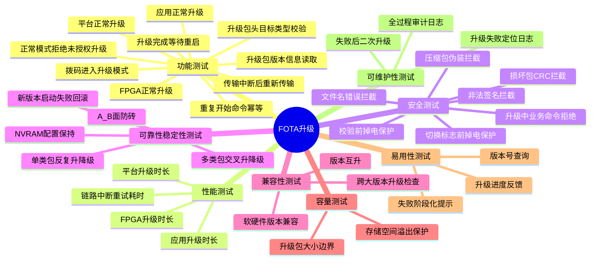
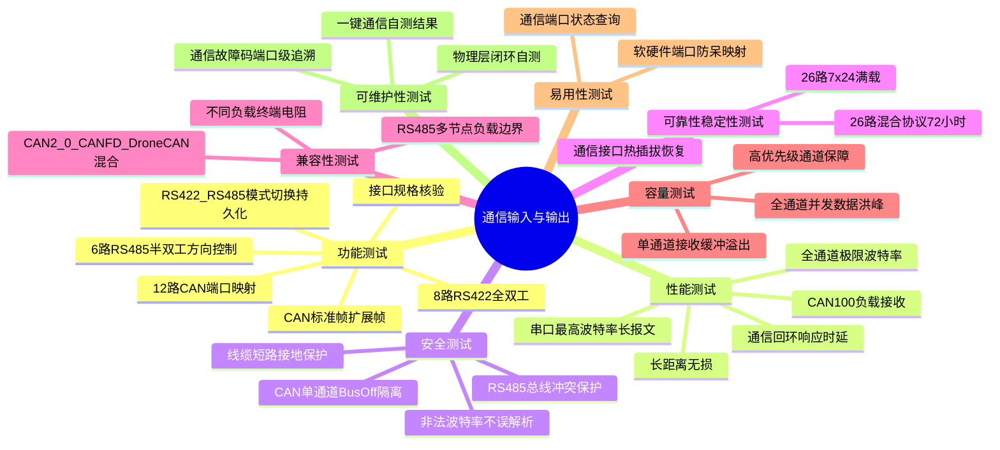
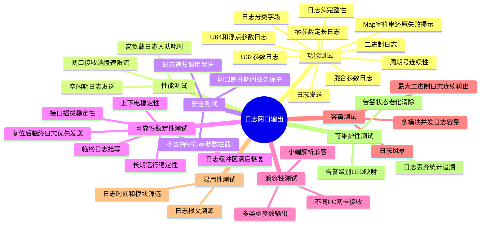
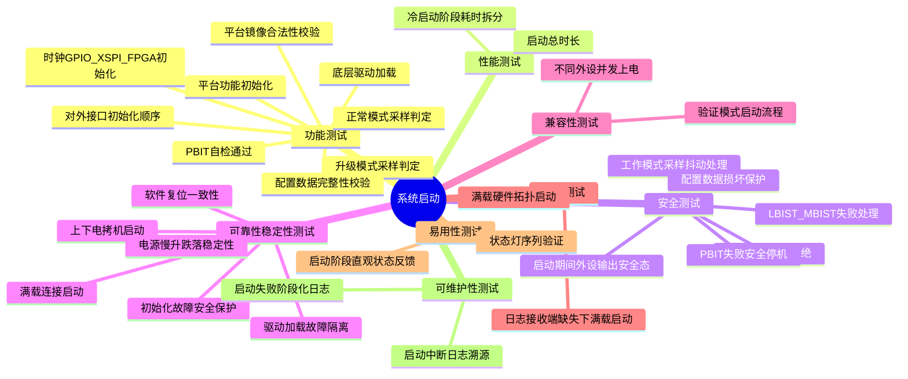
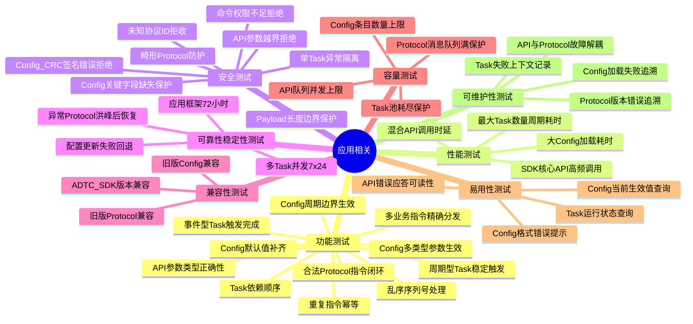

# 测试用例模块思维图

> 结构参照 `188.png`：模块为中心节点，按测试类型展开，再归纳主要黑盒测试主题。

## 安全调度

```mermaid
mindmap
  root((安全调度))
    功能测试
      相位顺序执行
      传感器数据采集
      外设反馈数据采集
      数据链数据采集
      多源并行输入
      跨相位数据隔离
      APP任务确定性调度
      遥控器和地面站指令调度
      调参与调试命令调度
    性能测试
      10ms周期抖动
      最大执行时间
      复杂算法边界
      满输入负载
      日志并发影响
    安全测试
      非法调参拦截
      CAN异常输入防护
      传感器半包错包乱序防护
      地面站非法payload防护
      遥控器心跳丢失保护
      运行中升级请求保护
    可靠性稳定性测试
      长时间周期稳定性
      典型飞行链路72小时
      输入信号丢失恢复
      底层降级输出拦截
    兼容性测试
      CAN2_0_CANFD_DroneCAN混合输入
      调试串口与地面站双通道调参
      不同物理总线时序兼容
    容量测试
      数据泛洪攻击
      全传感器与数据链并发
      调试命令突发
    易用性测试
      安全调度状态地面站上报
      运行中升级反馈
    可维护性测试
      调度异常日志追溯
      升级失败回滚追溯
```

## 安全监控

```mermaid
mindmap
  root((安全监控))
    功能测试
      正常10ms周期连续放行
      输入相位耗时超限识别
      应用相位耗时超限识别
      输出相位耗时超限识别
      输入相位特征值缺失
      应用相位特征值缺失
      输出相位特征值缺失
      相位乱序检测
      相位重复检测
      跨周期特征值清零
    性能测试
      时序监控精度
      监控开启开销
      故障到输出闭锁时延
    安全测试
      CAN输出闭锁
      RS422发动机输出闭锁
      全外设输出拦截
      合法边界不误触发
      合法噪声不误报
      监控模块无响应保护
    可靠性稳定性测试
      超时保护
      特征值异常恢复条件
      瞬时单周期超时策略
      7x24小时无误降级
    兼容性测试
      FOTA期间监控策略
      启动初始化阶段策略
      验证模式策略
    容量测试
      并发故障记录
      多故障同周期记录
      告警风暴稳定性
    易用性测试
      时序超时告警可读性
      数据流异常告警可读性
      监控拦截显性提示
    可维护性测试
      独立故障码追溯
      复位后故障原因保留
      不同监控故障码唯一性
```

## 外设输入数据处理

```mermaid
mindmap
  root((外设输入数据处理))
    功能测试
      IMU_CAN11输入
      数据链RS422_1输入
      IMU姿态缩放解析
      GPS_RTK定位解析
      空速计解析
      遥控器MAVLink解析
      地面站协议请求解析
      RS422分段重组
      RS422连续粘包解析
      同周期多帧取最新值
    性能测试
      高波特率解析耗时
      多源同周期解析耗时
      遥控器高频输入限流
    安全测试
      过期时间戳拒收
      合法链路非法payload拒收
      传感器越界保护
      CAN_BusOff后输入恢复
      RS422噪声流同步恢复
      CRC错误拦截
    可靠性稳定性测试
      脏数据隔离
      数据满载拷机
      输入接口热插拔
      全输入链路72小时
    兼容性测试
      CAN2_0_CANFD_DroneCAN输入
      串口460800bps输入
    容量测试
      CAN数据泛洪
      串口垃圾流泛洪
      输入缓冲临界容量
    易用性测试
      原始数据工程值可视化
      输入解析状态查询
    可维护性测试
      端口级协议级故障解耦
      输入故障码分类追溯
```

## 外设输出数据处理

```mermaid
mindmap
  root((外设输出数据处理))
    功能测试
      舵机KST_CAN10输出
      电调ESC_CAN09_CAN12输出
      发动机EP15G_RS422_3输出
      CAN输出字节序缩放
      RS422发动机字节序缩放
      仿真数据链状态上报
      输出使用最新应用结果
      舵机角度边界
      电调转速边界
    性能测试
      多通道并发输出时长
      控制计算完成到首帧时延
      全外设并发周期保持
      遥测高负载下控制输出优先
    安全测试
      超范围控制量限幅
      输出报文校验字段
      备系状态输出禁止
      闭锁后旧报文不重发
      CAN09_BusOff隔离
      RS422_3发送超时捕获
    可靠性稳定性测试
      安全监控异常输出拦截
      CAN输出断线恢复
      全输出链路72小时
      满负荷发包拷机
    兼容性测试
      高速CAN低速RS422混合
      真实外设与仿真负载一致
      接收端协议兼容
    容量测试
      输出发送队列临界容量
      仿真数据链大包容量
      极限吞吐量限流
    易用性测试
      输出报文工程值反解
      遥测包解析友好度
    可维护性测试
      BusOff精确捕获
      输出端口故障码追溯
```

## FOTA升级

```mermaid
mindmap
  root((FOTA升级))
    功能测试
      FPGA正常升级
      平台正常升级
      应用正常升级
      拨码进入升级模式
      正常模式拒绝未授权升级
      升级包头目标类型校验
      升级包版本信息读取
      传输中断后重新传输
      重复开始命令幂等
      升级完成等待重启
    性能测试
      FPGA升级时长
      平台升级时长
      应用升级时长
      链路中断重试耗时
    安全测试
      文件名错误拦截
      非法签名拦截
      损坏包CRC拦截
      压缩包伪装拦截
      升级中业务命令拒绝
      校验前掉电保护
      切换标志前掉电保护
    可靠性稳定性测试
      A_B面防砖
      新版本启动失败回滚
      NVRAM配置保持
      单类包反复升降级
      多类包交叉升降级
    兼容性测试
      版本互升
      软硬件版本兼容
      跨大版本升级检查
    容量测试
      存储空间溢出保护
      升级包大小边界
    易用性测试
      升级进度反馈
      版本号查询
      失败阶段化提示
    可维护性测试
      升级失败定位日志
      全过程审计日志
      失败后二次升级
```

## 通信输入与输出

```mermaid
mindmap
  root((通信输入与输出))
    功能测试
      接口规格核验
      12路CAN端口映射
      CAN标准帧扩展帧
      8路RS422全双工
      6路RS485半双工方向控制
      RS422_RS485模式切换持久化
    性能测试
      全通道极限波特率
      CAN100负载接收
      串口最高波特率长报文
      通信回环响应时延
      长距离无损
    安全测试
      线缆短路接地保护
      CAN单通道BusOff隔离
      RS485总线冲突保护
      非法波特率不误解析
    可靠性稳定性测试
      26路7x24满载
      通信接口热插拔恢复
      26路混合协议72小时
    兼容性测试
      不同负载终端电阻
      CAN2_0_CANFD_DroneCAN混合
      RS485多节点负载边界
    容量测试
      全通道并发数据洪峰
      单通道接收缓冲溢出
      高优先级通道保障
    易用性测试
      软硬件端口防呆映射
      通信端口状态查询
    可维护性测试
      物理层闭环自测
      通信故障码端口级追溯
      一键通信自测结果
```

## 日志网口输出

```mermaid
mindmap
  root((日志网口输出))
    功能测试
      日志发送
      日志头完整性
      零参数定长日志
      U32参数日志
      U64和浮点参数日志
      混合参数日志
      二进制日志
      日志分类字段
      周期号连续性
      Map字符串还原失败提示
    性能测试
      空闲期日志发送
      高负载日志入队耗时
      网口接收端慢速限流
    安全测试
      日志递归调用保护
      不支持字符串参数拦截
      网口断开期间业务保护
    可靠性稳定性测试
      临终日志抢写
      日志缓冲区满后恢复
      复位后临终日志优先发送
      长期运行稳定性
      接口插拔稳定性
      上下电稳定性
    兼容性测试
      小端解析兼容
      多类型参数输出
      不同PC网卡接收
    容量测试
      日志风暴
      最大二进制日志连续输出
      多模块并发日志容量
    易用性测试
      日志报文溯源
      日志时间和模块筛选
    可维护性测试
      告警级别LED映射
      告警状态老化清除
      日志丢弃统计追溯
```

## 系统启动

```mermaid
mindmap
  root((系统启动))
    功能测试
      平台镜像合法性校验
      时钟GPIO_XSPI_FPGA初始化
      PBIT自检通过
      正常模式采样判定
      升级模式采样判定
      配置数据完整性校验
      对外接口初始化顺序
      底层驱动加载
      平台功能初始化
    性能测试
      启动总时长
      冷启动阶段耗时拆分
    安全测试
      非法平台镜像拒绝
      PBIT失败安全停机
      LBIST_MBIST失败处理
      工作模式采样抖动处理
      配置数据损坏保护
      启动期间外设输出安全态
    可靠性稳定性测试
      驱动加载故障隔离
      初始化故障安全保护
      上下电拷机启动
      满载连接启动
      软件复位一致性
      电源慢升跌落稳定性
    兼容性测试
      不同外设并发上电
      验证模式启动流程
    容量测试
      满载硬件拓扑启动
      日志接收端缺失下满载启动
    易用性测试
      启动阶段直观状态反馈
      状态灯序列验证
    可维护性测试
      启动中断日志溯源
      启动失败阶段化日志
```

## 应用相关

```mermaid
mindmap
  root((应用相关))
    功能测试
      合法Protocol指令闭环
      多业务指令精确分发
      重复指令幂等
      乱序序列号处理
      API参数类型正确性
      Config默认值补齐
      Config多类型参数生效
      Config周期边界生效
      周期型Task稳定触发
      事件型Task触发完成
      Task依赖顺序
    性能测试
      SDK核心API高频调用
      混合API调用时延
      最大Task数量周期耗时
      大Config加载耗时
    安全测试
      未知协议ID拒收
      命令权限不足拒绝
      Payload长度边界保护
      API参数越界拒绝
      Config关键字段缺失保护
      Config_CRC签名错误拒绝
      单Task异常隔离
      畸形Protocol防护
    可靠性稳定性测试
      多Task并发7x24
      应用框架72小时
      异常Protocol洪峰后恢复
      配置更新失败回退
    兼容性测试
      旧版Config兼容
      旧版Protocol兼容
      ADTC_SDK版本兼容
    容量测试
      API队列并发上限
      Protocol消息队列满保护
      Task池耗尽保护
      Config条目数量上限
    易用性测试
      Config格式错误提示
      API错误应答可读性
      Config当前生效值查询
      Task运行状态查询
    可维护性测试
      API与Protocol故障解耦
      Protocol版本错误追溯
      Config加载失败追溯
      Task失败上下文记录
```
